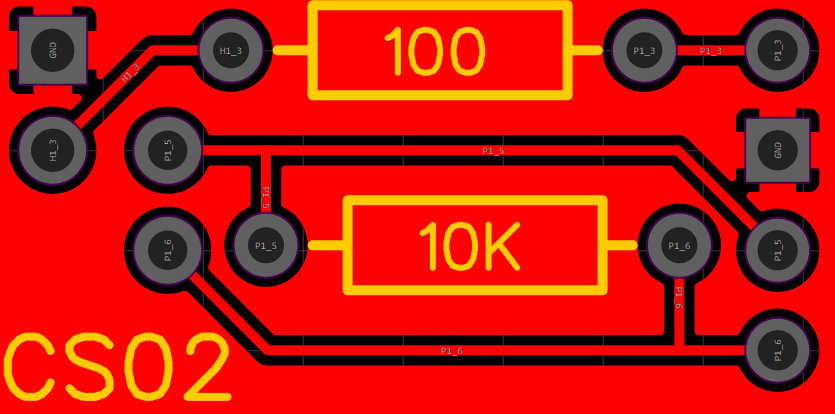
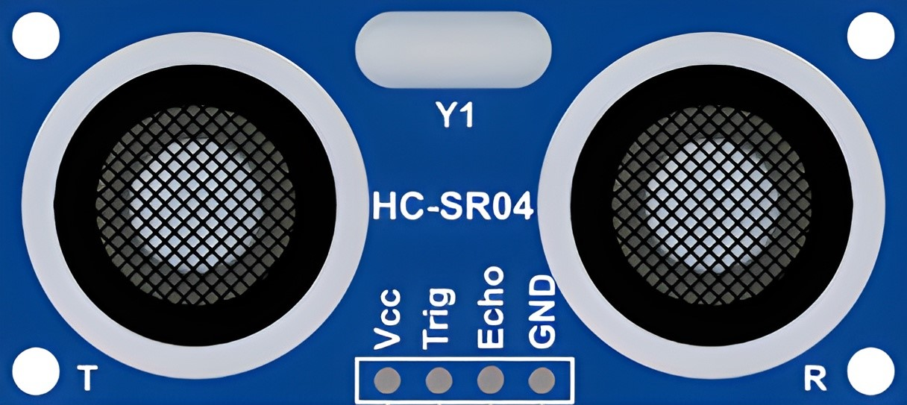

# Mountain Climb Robot

### Year 11 Robotics (11DTE)

## Task

The task of this robot is to drive along a road until it reaches a road block, once it reaches this point it has to turn right a continue until it reaches a hill at which point it must wait until another robot passes by, once it's gone it can continue its travel up the hill until it reaches another road. Now it must follow this road up a mountain at once it's at the top it must search for an object and knock it over.

## Solution

### Moving

The robot has a N20 motor on either side at the rear and free spinning wheels at the front, rubber tank tracks are then put on. The N20 motors are connected to a motor controller before connecting to the Arduino Uno.

### Sensors

The robot consists of the following sensors

- Ultrasonic Sensor (HC-SR04)
- Light Sensors
	- White LED
	- Light Dependant Resistor (LDR)
- Tilt Sensor (SPST Mercury Switch)
- Microphone

### Staying on the road

There are two light sensors positioned facing down on either side of the robot, as the road is grey the amount of light reflected back to the LDR is very different to the amount of light the green grass reflects. We can use this check if either side of the robot has gone off the road and into the grass, we can then correct this by turning in the opposite direction. The two sensors are read from analog pins `A4` and `A5`.

### Detecting Objects

The HC-SR04 ultrasonic sensor is used to detect objects in front of the robot. This is done by first triggering the ultrasonic transmitter by sending a 10 microsecond high pulse on the `trig` pin.  This will emit a 40 kHz sound which travels through the air and bounces back when it hits an object. This reflected sound wave is then received by the ultrasonic receiver. To read the result of the scan we can wait for the `echo` pin to become high and then time how long it takes to become low again, this gives us the time in microseconds the echo took. We can then multiply this by the speed of sound in centimetres per microsecond which is 0.0343. This gives us the distance the round trip distance so to get just the distance from the robot to the object we must divide it by 2. I'm using digital pins 7 for `TRIG` and 6 for `ECHO`.

### Detecting Hills

Detecting when the robot is on a hill is very easy, the mercury switch has two pins, one for power and one we read. When the robot tilts the mercury connects the two pins forming a circuit, and the pin we read will become high. I'm using digital pin 2.

### Detecting other robots

We can detect if another robot is near using a microphone, this is as easy as reading the microphones analog pin, in this case, `A0`.